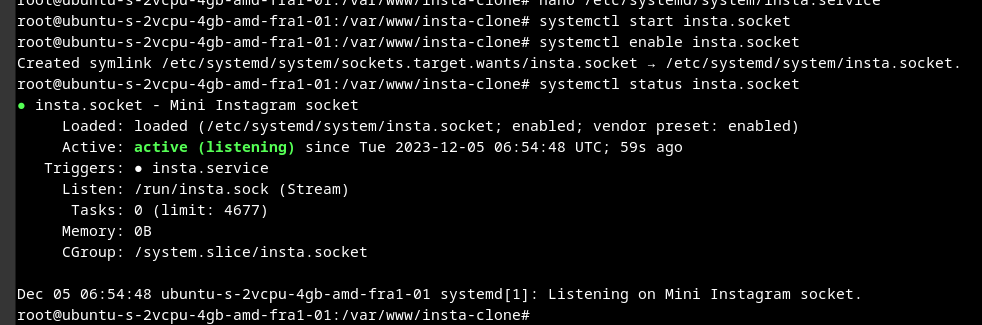

# insta-clone
instagram cloni, django rest API da qilingan


DATABASE DESIGN uchun https://drawsql.app/ saytidan foydalanildi
# Insta-clone-db-design
Mini instagram [clonining Database designi](https://drawsql.app/teams/alpha-76/diagrams/insta-clone)


# Instruction

```sh 
git clone https://github.com/jaloliddin1006/insta-clone.git & cd insta-clone
```
#

 Virtual muhit o'rnatamiz, agar mavjud bo'lsa kerakmas, faqat virtual muhit yaratim activlashtiramiz

```
- sudo apt-get install python3-virtualenv
- virtualenv venv 
- source venv/bin/activate
- cp .env.example .env
```

.env faylini o'zingizni sozlamalaringizni o'rnating

- pip install -r requirement.txt
- mkdir static
- python manage.py collectstatic
- python manage.py runserver 0.0.0.0:8000


# deploy qishil uchun tayyorlaymiz
- pip install gunicorn
- deactivate

#
- sudo nano /etc/systemd/system/insta.socket 

insta.socket fayl ichiga quidagi ni yozamiz

```sh
[Unit]
Description=Mini Instagram socket

[Socket]
ListenStream=/run/insta.sock

[Install]
WantedBy=sockets.target
```

#
- sudo nano /etc/systemd/system/insta.service

insta.service falnini ichini to'ldiramiz:

```sh
[Unit]
Description=Mini Instagram daemon
Requires=insta.socket
After=network.target

[Service]
User=root
WorkingDirectory=/var/www/insta-clone
ExecStart=/var/www/insta-clone/venv/bin/gunicorn \
        #   --access-logfile - \
        #   --workers 2 \  
          --bind unix:/run/insta.sock \
          insta.wsgi:application

[Install]
WantedBy=multi-user.target
```
socket ni ishga tushirib qoyamiz
```sh
     sudo systemctl start insta.socket
     sudo systemctl enable insta.socket
     sudo systemctl status insta.socket
```

hammasi muvaffaqiyatli bo'lgan bo'lsa quidagicha natija chiqishi kerak


#

- sudo journalctl -u insta.socket

#

# Testing Socket Activation
- sudo systemctl status insta
- curl --unix-socket /run/insta.sock localhost
- sudo systemctl status insta
- sudo journalctl -u insta

- sudo systemctl daemon-reload
- sudo systemctl restart insta


# Configure Nginx to Proxy Pass to Gunicorn
### install nginx
- sudo apt update
- sudo apt install nginx

check nginx and allow
- sudo ufw app list
- sudo ufw status

check nginx install
- systemctl status nginx

### setting nginx
- sudo nano /etc/nginx/sites-available/insta

```sh
server {
    # listen 80;
    server_name server_domain_or_IP;

    location = /favicon.ico { access_log off; log_not_found off; }
    location /static/ {
        root /var/www/insta-clone;
    }

    location / {
        include proxy_params;
        proxy_pass http://unix:/run/insta.sock;
    }
}
```
#

- sudo ln -s /etc/nginx/sites-available/insta /etc/nginx/sites-enabled
- sudo nginx -t
- sudo systemctl restart nginx
- sudo systemctl daemon-reload
- sudo systemctl restart insta
- sudo systemctl restart insta.socket insta.service

- sudo nginx -t && sudo systemctl restart nginx


# CERTBOT setting

- sudo apt install certbot python3-certbot-nginx
- sudo nano /etc/nginx/sites-available/insta

```sh
server {
    # listen 80;
    server_name instagram.mamatmusayev.uz;
 ...
 ...
 ...
}
```
- sudo nginx -t
- sudo systemctl reload nginx

- sudo ufw allow 'Nginx Full'
- sudo ufw delete allow 'Nginx HTTP'

ssl serifikatini domenga qoyish

- sudo certbot --nginx -d instagram.mamatmusayev.uz -d www.instagram.mamatmusayev.uz

- systemctl daemon-reload

- sudo systemctl restart nginx
- sudo systemctl daemon-reload
- sudo systemctl restart insta